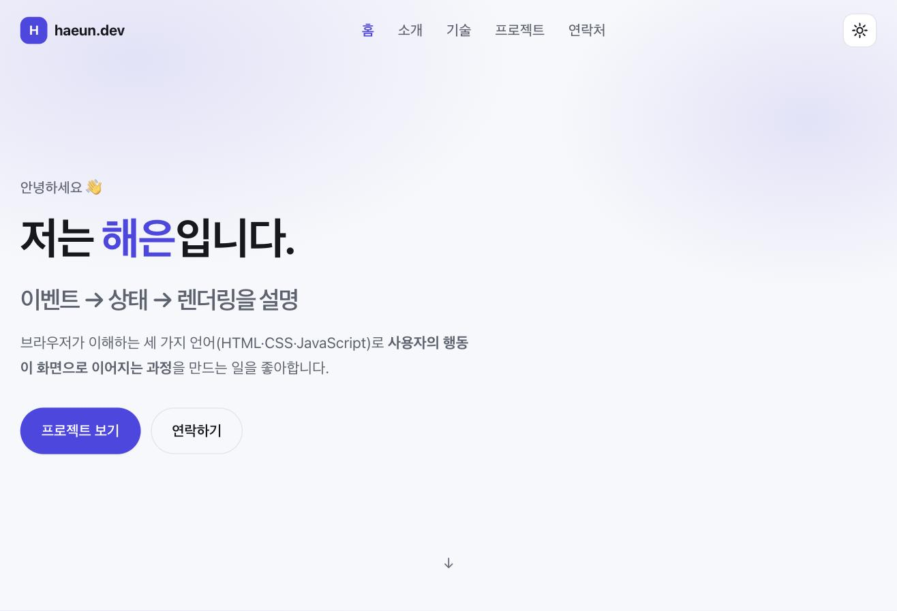
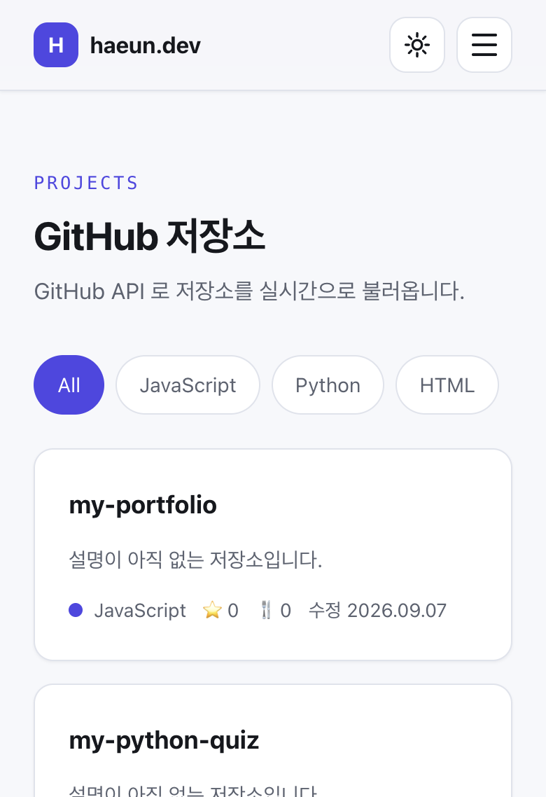
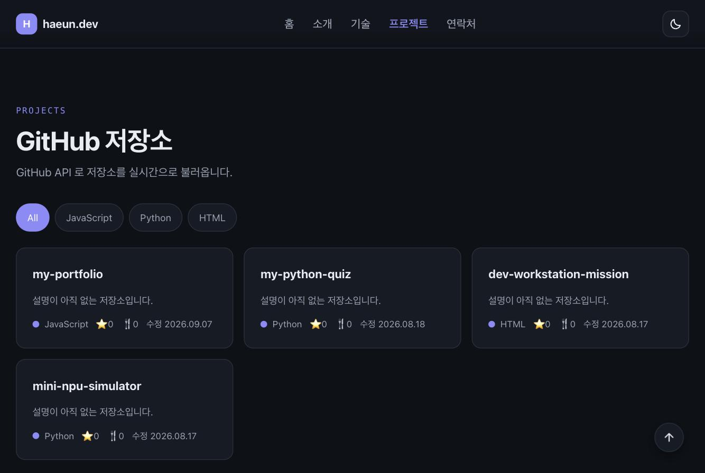

# 나를 소개하는 웹페이지 (Personal Portfolio)

> Codyssey AI 올인원 2기 · 본과정 AI·SW 기초 · **웹 기초와 프론트엔드** 미션
> 외부 라이브러리 없이 **순수 HTML + CSS + JavaScript** 로 처음부터 만든 반응형 포트폴리오입니다.

## 🔗 링크

| 항목 | 주소 |
| --- | --- |
| 배포 사이트 | **https://haeunyn.github.io/my-portfolio/** |
| GitHub 저장소 | **https://github.com/haeunyn/my-portfolio** |

## 📸 스크린샷

| 데스크톱 | 모바일 | 다크 모드 |
| --- | --- | --- |
|  |  |  |

## 🧰 사용 기술

- **HTML5** — 시맨틱 태그(`header`, `nav`, `main`, `section`, `article`, `footer`)
- **CSS3** — 커스텀 속성(CSS 변수), Flexbox, Grid, 미디어 쿼리, 트랜지션/애니메이션
- **JavaScript (ES6+)** — DOM API, 이벤트, `fetch` + `async/await`, Intersection Observer, localStorage
- **GitHub REST API** — 저장소 목록 조회
- **GitHub Pages** — 정적 배포

> 프레임워크·UI 라이브러리(React, Vue, jQuery, Bootstrap, Tailwind) **미사용**.
> 웹폰트·아이콘 라이브러리도 쓰지 않고, 아이콘은 인라인 SVG 로 직접 그렸습니다.

## 📁 폴더 구조

```
my-portfolio/
├── index.html          # 메인 페이지 (구조)
├── css/
│   └── style.css       # 전체 스타일 (표현)
├── js/
│   ├── config.js       # 내 정보 + 동작 기준값 (데이터/설정)
│   └── main.js         # 모든 동작 (이벤트 → 상태 → 렌더링)
├── images/
│   ├── profile.svg     # 프로필 이미지
│   └── favicon.svg     # 탭 아이콘
├── docs/               # 동료평가 준비 자료 (설명 대본, 예상질문, 코드 해설)
└── README.md
```

## ✨ 구현 기능

### 1. 반응형 레이아웃 (모바일 퍼스트)
- 기본 스타일은 모바일 기준으로 작성하고, `@media (min-width: 768px)` / `(min-width: 1024px)` 로 확장
- 네비게이션은 **Flexbox**(가로 한 줄), 프로젝트/스킬 카드는 **Grid**(`auto-fit` + `minmax`)

### 2. 인터랙션
| 기능 | 동작 |
| --- | --- |
| 햄버거 메뉴 | 768px 미만에서 버튼 표시, 클릭 시 메뉴 토글(`classList.toggle`), ESC 로 닫힘 |
| 부드러운 스크롤 | 메뉴 클릭 → `preventDefault()` 후 `scrollIntoView({behavior:'smooth'})` |
| 헤더 스타일 변경 | 스크롤 **60px** 이상에서 배경 블러 + 그림자 |
| 맨 위로 버튼 | 스크롤 **300px** 이상에서 표시 |
| 스크롤 스파이 | 현재 보고 있는 섹션의 메뉴가 강조됨 |
| 등장 애니메이션 | Intersection Observer, 임계값 **0.2** (20% 보이면 실행) |
| 타이핑 효과 | Hero 문구가 한 글자씩 입력/삭제 반복 |
| 다크 모드 | 토글 → `<html data-theme>` 변경 → **localStorage 저장**(새로고침 후 유지) |

### 3. GitHub API 연동 (Projects)
- `GET https://api.github.com/users/{아이디}/repos?sort=updated&per_page=100`
- 네 가지 상태를 모두 UI로 표현
  - **로딩** — 스피너 + 스켈레톤 카드
  - **성공** — 카드 그리드 (이름/설명/토픽/언어/⭐/포크/수정일)
  - **에러** — 실패 메시지 + **다시 시도** 버튼 (403 레이트리밋 / 404 / 네트워크 오류를 구분해 안내)
  - **빈 상태** — "표시할 프로젝트가 없습니다"
- 포크한 저장소는 제외하고, 스타 많은 순으로 정렬
- 언어별 **필터 버튼** (보너스 과제)

### 4. Contact 폼 유효성 검사
- 이름(2자 이상) / 이메일(형식 검사) / 메시지(10자 이상)
- 에러 메시지를 **해당 입력창 바로 아래** 표시 + 테두리 색 변경 + `aria-invalid`
- 제출 시 `event.preventDefault()`, 통과하면 성공 메시지 표시 후 폼 초기화

### 5. 접근성 / 기타
- 모든 이미지에 의미 있는 `alt`, 모든 입력에 `label[for]` ↔ `input[id]` 연결
- `aria-expanded`, `aria-pressed`, `aria-live`, 본문 바로가기 링크, 포커스 링 유지
- `prefers-color-scheme` (시스템 다크 모드 감지), `prefers-reduced-motion` (모션 최소화) 존중

## 🔢 기준값 (과제에서 "자유 변경 가능하나 README에 명시" 항목)

`js/config.js` 의 `CONFIG` 객체 한 곳에 모여 있습니다.

| 상수 | 값 | 의미 |
| --- | --- | --- |
| `NAV_SCROLL_THRESHOLD` | `60` | 헤더 배경이 바뀌는 스크롤 위치(px) |
| `SCROLL_TOP_THRESHOLD` | `300` | 맨 위로 버튼이 나타나는 스크롤 위치(px) |
| `OBSERVER_THRESHOLD` | `0.2` | 등장 애니메이션 임계값(요소가 20% 보이면) |
| `TYPING_SPEED` / `TYPING_ERASE_SPEED` / `TYPING_HOLD` | `70` / `35` / `1600` | 타이핑 효과 속도(ms) |
| `REPO_COUNT` | `100` | 한 번에 요청할 저장소 개수 |

## 🚀 실행 방법

1. VS Code 에서 이 폴더를 연다.
2. 확장 **Live Server** 설치 → `index.html` 우클릭 → **Open with Live Server**
3. 브라우저에서 `http://127.0.0.1:5500` 접속

> `index.html` 을 더블클릭해 여는 방식(`file://`)도 대부분 동작하지만,
> 개발 중에는 자동 새로고침이 되는 Live Server 사용을 권장합니다.

## ⚙️ 내용 수정하기

페이지에 들어가는 정보는 `js/config.js` 상단에 모여 있습니다.

```js
const PROFILE = {
  name: '해은',
  githubUsername: 'haeunyn',          // Projects 섹션이 이 계정의 저장소를 불러옵니다
  email: 'haeunyn@gmail.com',
  taglines: [ /* Hero 에 타이핑될 문장들 */ ],
};
```

- 스킬 카드를 늘리거나 줄이려면 같은 파일의 `SKILLS` 배열을 수정하세요.
- 이름·소개 문장은 `index.html` 의 Hero / About 섹션에서 직접 수정합니다.

## 📦 GitHub Pages 배포

```bash
git init
git add .
git commit -m "feat: 나를 소개하는 웹페이지 완성"
git branch -M main
git remote add origin git@github.com:haeunyn/my-portfolio.git
git push -u origin main
```

GitHub 저장소 → **Settings → Pages → Source: Deploy from a branch → main / (root) → Save**
1~2분 뒤 배포됩니다. (이 저장소는 이미 배포 완료: https://haeunyn.github.io/my-portfolio/)

이후 수정 사항은 `git add -A && git commit -m "메시지" && git push` 만 하면 자동으로 재배포됩니다.

> ⚠️ GitHub API 는 인증 없이 **시간당 60회** 제한이 있습니다.
> 짧은 시간에 새로고침을 반복하면 403 응답이 오고, 이때는 의도한 대로 에러 상태 UI가 표시됩니다.

## 🧠 이 미션에서 배운 것

이 프로젝트의 모든 기능은 하나의 흐름으로 되어 있습니다.

```
사용자 이벤트  →  상태(state) 변경  →  화면 렌더링
addEventListener      state 객체 수정        render 함수
```

- 다크 모드 토글 → `state.theme` 변경 → `data-theme` 속성 교체 → 전체 색 변경
- API 호출 → `state.projects.status` 변경(loading→success/error) → Projects 섹션 재렌더링
- 폼 입력/제출 → `state.formErrors` 변경 → 에러 메시지 표시/숨김
- 필터 클릭 → `state.activeLanguage` 변경 → 목록 재렌더링

React 의 `useState` + 리렌더링은 이 흐름을 자동화한 것이며, 다음 미션의 기반이 됩니다.

## 📄 라이선스

학습용 개인 프로젝트입니다. 코드와 이미지는 직접 작성했습니다.
